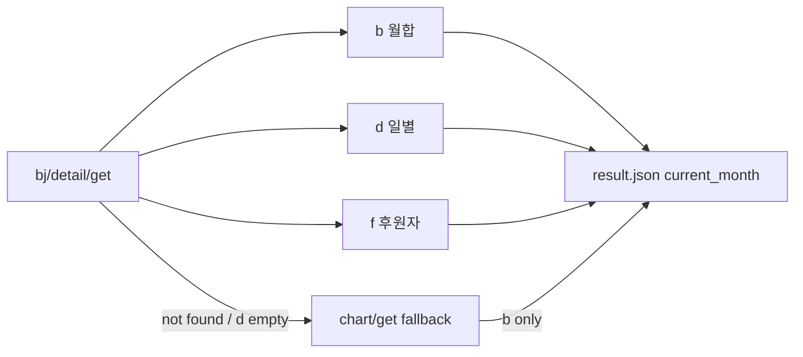

# bj/detail/get JSON 항목 정리

풍투 `bj/detail/get` API 응답에서 이 프로젝트가 읽는 필드와 `result.json` 저장 형태입니다.  
구현: [`main.py`](../main.py) (`fetch_balloon`, `extract_*`, `build_month_data`, `resolve_month_balloon_data`).

## 요청 URL

```
https://static.poong.today/bj/detail/get?id={user_id}&year={year}&month={month}
```

## 최상위 (detail/get 응답)

| 키 | 의미 | 코드에서 쓰는 곳 |
|----|------|------------------|
| **`b`** | 해당 월 **누적 별풍선 합계** | `extract_total_balloons` → `current_month.total_balloons` |
| **`d`** | **일별** 별풍선 배열 (비어 있으면 “해당 월 데이터 없음”으로 간주) | `extract_daily_balloons` → `daily_balloons[]` |
| **`f`** | **후원자(팬/큰손)** 배열, 상위 50명만 사용 | `extract_fans(limit=50)` → `fans[]` |
| **`error`** | `"not found"` 등 — 해당 월 데이터 미생성 | `is_poong_not_found_response` → chart/get fallback |

`d` 배열이 없거나 비어 있으면 detail 성공으로 보지 않고 `resolve_month_balloon_data`에서 **chart/get**으로 넘깁니다.

## `d[]` 각 항목 (일별)

| 키 | 의미 | 저장 형태 |
|----|------|-----------|
| **`d`** | 일(day) | `{ "day": … }` |
| **`b`** | 그날 별풍선 | `{ "balloons": … }` |

## `f[]` 각 항목 (후원자)

| 키 | 의미 | 저장 형태 |
|----|------|-----------|
| **`i`** | 후원자 user_id | `user_id` |
| **`n`** | 닉네임 | `nickname` |
| **`b`** | 별풍선 수 | `balloons` |
| **`c`** | 후원 횟수 | `count` (+ `avg_balloons` = b/c) |

## result.json에 들어가는 월 객체 (`build_month_data`)

detail 성공 시 `data_source: "detail"`과 함께:

```json
{
  "year": 2026,
  "month": 6,
  "total_balloons": 0,
  "daily_balloons": [{ "day": 1, "balloons": 0 }],
  "fans": [
    {
      "user_id": "...",
      "nickname": "...",
      "balloons": 0,
      "count": 0,
      "avg_balloons": 0
    }
  ],
  "data_source": "detail"
}
```

## detail 실패 시 (chart/get fallback)

`detail/get`이 없거나 `d`가 비어 있을 때는 **chart/get**만 사용합니다. 그때는 **`b`(월합)만** 가져오고 `d`, `f`는 빈 배열입니다 (`data_source: "chart_ranking"`).

chart/get 랭킹 한 줄: `i` = BJ user_id, `b` = 월간 누적 별풍선.


