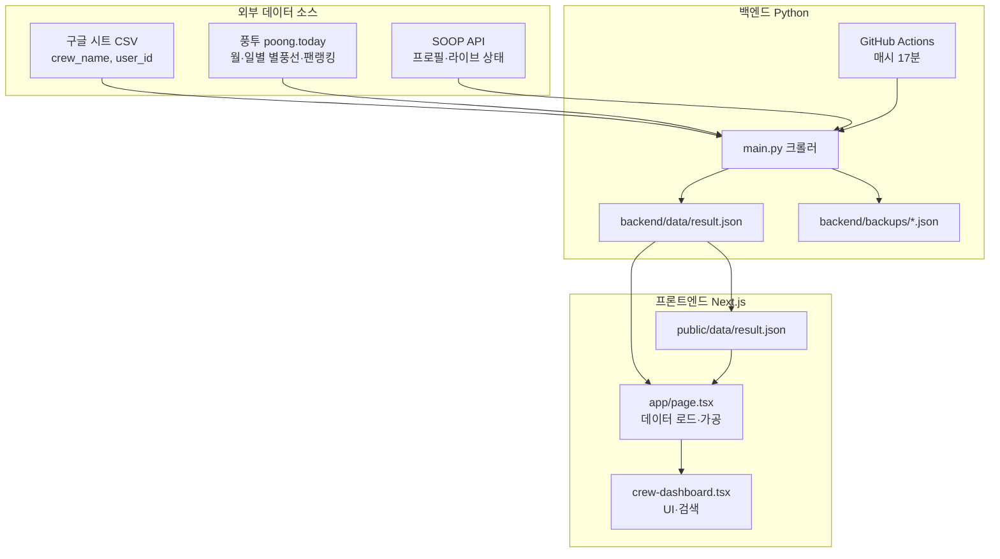

# 엑셀 크루 낙수표 — 기획·설계 설명서

> SOOP(숲) 크루별 별풍선 낙수 현황을 한눈에 보여주는 웹 서비스  
> 저장소: [jojimedia/naksoo-project](https://github.com/jojimedia/naksoo-project)

---

## 1. 프로젝트 개요

### 1.1 서비스명

**엑셀 크루 낙수표** (내부 프로젝트명: `naksoo`)

### 1.2 한 줄 요약

SOOP 숲 플랫폼에서 활동하는 **크루(엑셀 크루 등) 소속 스트리머**들의 월간 별풍선 수익(낙수)을 크루 단위로 모아 보여주고, 후원자·랭킹·검색 기능을 제공하는 대시보드이다.

### 1.3 기획 의도

| 배경 | 의도 |
|------|------|
| 크루원별 별풍선 실적이 외부 통계 사이트에 분산되어 있음 | 크루 단위로 **한 화면에서 비교·탐색**할 수 있게 한다 |
| 스프레드시트로 수동 집계하던 낙수표 문화 | **자동 수집 + 정기 갱신**으로 운영 부담을 줄인다 |
| 후원자(큰손)와 낙수의 신(분산 후원자) 파악이 어려움 | 크루별 **후원 구조 분석 뷰**를 제공한다 |
| 모바일·PC 모두에서 빠르게 조회 필요 | **정적 JSON 기반**의 가벼운 프론트엔드로 배포한다 |

핵심 가치는 **투명한 크루 내부 경쟁/협력 지표 공유**와 **팬·후원 데이터 탐색 편의성**이다. 공식 SOOP API가 아닌 [풍투(poong.today)](https://poong.today) 통계를 데이터 소스로 사용한다.

---

## 2. 문제 정의와 해결 방향

### 2.1 해결하려는 문제

1. **정보 분산** — 스트리머마다 개별 통계 페이지를 열어봐야 크루 전체 그림을 알 수 없다.
2. **수동 집계** — 구글 시트·엑셀로 크루원 목록을 관리하고 수치를 옮기는 작업이 반복된다.
3. **후원자 추적** — 특정 큰손이 어느 크루·어느 스트리머에게 후원했는지 한 번에 찾기 어렵다.
4. **갱신 지연 인지** — 데이터가 언제 마지막으로 갱신됐는지 사용자가 알기 어렵다.

### 2.2 해결 전략

```
[구글 시트: 크루원 목록]  →  [백엔드 크롤러]  →  [result.json]  →  [Next.js 대시보드]
         ↑                         ↑
    운영자가 유지              풍투 + SOOP API
```

- **크루원 마스터 데이터**는 구글 시트 CSV로 운영자가 관리한다.
- **별풍선·후원자 수치**는 백엔드가 외부 소스에서 자동 수집한다.
- **집계·랭킹·낙수의 신 선정**은 프론트엔드에서 `result.json`을 가공해 계산한다.
- **GitHub Actions**가 시간당 정기 실행하여 JSON을 커밋·배포 파이프라인에 반영한다.

---

## 3. 타겟 사용자

| 사용자 | 사용 목적 |
|--------|-----------|
| 크루 운영진·멤버 | 크루 내 낙수 순위, 전월 대비 증감 확인 |
| 시청자·팬 | 관심 스트리머·큰손 검색, 후원 랭킹 탐색 |
| 외부 관찰자 | 크루 간 평균 낙수 비교 |

---

## 4. 핵심 기능

### 4.1 크루 카드 대시보드 (기본 화면)

- 크루별 카드로 **멤버 목록·월간 별풍선·크루 합계·절사평균** 표시
- 크루 순위: **크루 절사평균 월간 별풍선** 내림차순
- 절사평균: **휴직 제외** 후 활성 멤버의 **최고·최저 각 1명**을 제외한 산술평균 (활성 3명 미만이면 전체 평균)
- 멤버 삭제는 시트 행 삭제가 아니라 **퇴사 처리**로 `crew_name`을 `FA`로 변경한다
- FA 소속 스트리머를 다시 등록하면 해당 크루로 `crew_name`이 이동한다
- `crew_name`이 `FA`인 멤버는 크루 카드/순위에서 제외되고, 상단 **FA** 탭의 리스트로만 표시
- 멤버 순위: **개인 월간 별풍선** 내림차순
- 반응형 그리드: 모바일 1열 → md 3열 → lg 5열

### 4.2 스트리머 상세 (행 펼치기)

각 크루원 행을 클릭하면 펼쳐지는 패널:

- 전월 별풍선 / 증감·증감률 / 오늘 별풍선
- **이달의 후원자 TOP 10**
- 라이브 방송 여부 표시 (수집 데이터 기준)

### 4.3 낙수의 신 (Naksoo Gods)

크루 내 **여러 스트리머에게 고르게 후원하는 팬**을 선별하는 지표.

선정 조건 (프론트엔드 계산):

| 항목 | 규칙 |
|------|------|
| 월 보정률 | `max(월 진행 일수 / 월 총 일수, 25%)` — 월초 과소 평가 방지 |
| 총 후원 컷 | `max(크루 합계 보정값 1%, 크루 평균 보정값 15%, 전체 평균 보정값 18%)` |
| 개인별 컷 | 전체 평균 보정값의 **1.2%** 이상 후원한 스트리머 수 |
| 분산 조건 | 컷 이상 대상 **3명 이상**, 최대 대상에게 몰빵 비율 **80% 미만** |
| 상한 | 크루당 최대 **10명** |

카드 내 `i` 버튼으로 계산식을 UI에서 확인할 수 있다.

### 4.4 큰손 랭킹 (Crew Kings)

크루 내 **총 후원액 상위 후원자** 15명. 낙수의 신과 달리 분산·몰빵 필터 없이 단순 합산 순위이다.

### 4.5 검색

| 모드 | 동작 |
|------|------|
| **멤버** | 닉네임·user_id로 크루원 필터, 해당 멤버만 포함된 크루 카드 표시 |
| **큰손** | 후원자 닉네임·user_id 검색 → 후원 크루·스트리머·별풍선 목록 카드 |
| **전체** | 모든 크루원을 통합한 **전체순위** 단일 리스트 (별풍선 내림차순) |

### 4.6 데이터 신선도 표시

헤더에 마지막 업데이트 시각과 출처(풍투)를 표시한다.

| 경과 시간 | 상태 |
|-----------|------|
| 12시간 미만 | 정상 |
| 12~24시간 | 확인 필요 (노란색) |
| 24시간 이상 | 업데이트 지연 (빨간색) |

### 4.7 점수 구간 색상 (Score Tone)

별풍선 규모에 따라 행 배경색을 단계적으로 적용한다.

| 구간 | 색상 의미 |
|------|-----------|
| 200,000+ | 보라 |
| 500,000+ | 청록 |
| 700,000+ | 노랑 |
| 1,000,000+ | 빨강 |

---

## 5. 시스템 아키텍처



### 5.1 설계 원칙

| 원칙 | 설명 |
|------|------|
| **JSON 중심** | DB 없이 단일 `result.json`이 진실의 원천(Single Source of Truth) |
| **수집·표현 분리** | 백엔드는 raw 수집, 프론트는 랭킹·낙수의 신 등 파생 지표 계산 |
| **실패 복구** | 크롤 실패 시 백업 스냅샷·이전 result·GitHub 히스토리에서 복구 |
| **서버리스 친화** | 프론트는 정적/ISR 없이 `force-dynamic` + GitHub raw URL fetch |

---

## 6. 데이터 흐름

### 6.1 수집 파이프라인 (백엔드)

`backend/main.py` 실행 순서:

1. KST 기준 현재월·이전달 기간 계산
2. 구글 시트 CSV에서 `{ crew_name, user_id }` 목록 로드
3. 멤버별 병렬 수집 (동시 요청 Semaphore 제한)
   - SOOP station API: 닉네임, 프로필, 방송 시작
   - SOOP live API: 라이브·비번방 여부
   - **풍투** `bj/detail/get`: 현재월·이전월 별풍선 합계, 일별, 팬랭킹 (실패 시 `chart/get`)
4. 실패 항목은 이전 `result.json` / 백업에서 복구
5. 비정상 월 데이터(미래 일자 포함 등) 감지 후 복구
6. `result.json` 저장 + 타임스탬프 백업 스냅샷 생성
7. 전체 실패 시 최신 백업으로 `result.json` 덮어쓰기

### 6.2 배포 파이프라인 (CI)

`.github/workflows/run.yml`:

- **스케줄**: `17 */1 * * *` (매시 17분, UTC)
- Python 3.11 + `pip install -r requirements.txt`
- `python main.py` 실행
- `backend/data/result.json` → `frontend/public/data/result.json` 복사
- 변경 시 `auto update result json` 커밋 후 push

### 6.3 프론트엔드 데이터 로드

`frontend/app/page.tsx`:

| 환경 | 데이터 소스 |
|------|-------------|
| 개발/프로덕션 기본 | GitHub raw `backend/data/result.json` |
| 로컬 JSON 사용 | `NAKSOO_USE_LOCAL_DATA=1` 일 때만 |

로드 후 `makeCrewCardData()`에서 크루별 집계·낙수의 신·큰손 랭킹을 계산해 `CrewDashboard`에 전달한다.

---

## 7. 데이터 모델

### 7.1 `result.json` (백엔드 출력)

```json
{
  "project": "naksoo",
  "created_at": "ISO-8601 KST",
  "created_date": "YYYY-MM-DD",
  "created_time": "HH:MM:SS",
  "timezone": "Asia/Seoul",
  "current_period": { "year": 2026, "month": 6 },
  "previous_period": { "year": 2026, "month": 5 },
  "calendar_current_period": { "year": 2026, "month": 6 },
  "used_month_fallback": false,
  "count": 101,
  "items": [ /* 멤버별 레코드 */ ]
}
```

### 7.2 `items[]` 멤버 레코드

| 필드 | 설명 |
|------|------|
| `crew_name` | 소속 크루명 (시트 기준) |
| `user_id` | SOOP 방송국 ID |
| `nickname` | 닉네임 |
| `profile_image_url` | 프로필 이미지 |
| `broadcast_start` | 방송 시작 시각 |
| `is_live` | 라이브 여부 |
| `is_password_broadcast` | 비번방 여부 |
| `current_month` | 현재월 `{ year, month, total_balloons, daily_balloons, fans[] }` |
| `previous_month` | 이전월 (동일 구조) |
| `success` | 수집 성공 여부 |

### 7.3 `fans[]` 후원자 레코드

| 필드 | 설명 |
|------|------|
| `user_id` | 후원자 SOOP ID |
| `nickname` | 후원자 닉네임 |
| `balloons` | 별풍선 합계 |
| `count` | 후원 횟수 |
| `avg_balloons` | `balloons / count` (정수) |

### 7.4 프론트엔드 파생 모델 `CrewCardData`

백엔드 raw 데이터를 크루 단위로 묶은 뷰 모델:

- `members[]` — 정렬·증감률·TOP 팬 포함
- `naksoo_gods[]` — 낙수의 신 목록
- `crew_kings[]` — 큰손 랭킹
- `current_total_balloons`, `average_current_balloons`, `rank`

---

## 8. 외부 연동

### 8.1 구글 시트 (크루원 마스터)

- CSV export URL로 읽기 전용 접근
- 필수 컬럼: `crew_name`, `user_id`
- 크루 추가·멤버 변경은 시트 수정만으로 반영 (다음 크롤 주기에 적용)

### 8.2 풍투 (poong.today) — 기본 데이터 소스

`bj/detail/get` → 실패 시 `chart/get`. 상세: `backend/docs/bj-detail-get.md`

```
https://static.poong.today/bj/detail/get?id={user_id}&year={year}&month={month}
```

> detail의 `d[]`(일별)로 **오늘 별풍선**을 채운다. chart fallback은 월합만 제공한다.

### 8.3 풍고 (poonggo.com) — 폴백 (비활성 기본)

`NAKSOO_ENABLE_POONGGO_FALLBACK=1`일 때만 풍투 실패 후 station 월간 HTML을 사용한다. 일별 배열은 비어 있다. 상세: `backend/docs/poonggo-station-monthly.md`  
상세: `backend/docs/bj-detail-get.md`

### 8.4 SOOP API

| API | 용도 |
|-----|------|
| `api-channel.sooplive.com/.../station` | 프로필·닉네임 |
| `live.sooplive.co.kr/afreeca/player_live_api.php` | 라이브·비번방 |

---

## 9. UI/UX 설계

### 9.1 비주얼 아이덴티티

- **다크 테마**: 배경 `#111018`, 카드 `#17151f`, 보더 `#3a3548`
- **포인트 컬러**: 라벤더 `#a99cff`, 액센트 `#5b4bdb`
- **도트 그리드 배경**: 레트로 대시보드 느낌
- **크루 헤더**: 인덱스별 고정 팔레트 + 황금각 분산 HSL (크루 수 증가 대응)

### 9.2 컴포넌트 구조

```
app/
├── page.tsx              # 서버: 데이터 fetch·가공
├── crew-dashboard.tsx    # 클라이언트: 헤더·검색·레이아웃
├── crew-card.tsx         # 크루 카드 (헤더 + 본문 모드 전환)
├── streamer-member-row.tsx  # 멤버 행 + 후원자 패널
├── mobile-crew-card.tsx   # 모바일 아코디언 래퍼
└── api/result/route.ts   # 로컬 result.json API (개발·디버그용)
```

### 9.3 반응형 동작

| 뷰포트 | 크루 카드 | 카드 내부 |
|--------|-----------|-----------|
| 모바일 (`< md`) | `MobileCrewCard` 아코디언 — 헤더 탭으로 펼침 | 동일 본문 |
| 데스크톱 (`≥ md`) | 항상 펼쳐진 `section` | 스트리머 / 낙수의 신 / 큰손 탭 전환 |

검색·전체순위 모드에서는 카드 그리드 대신 **단일 열(max 520px)** 로 집중 레이아웃을 사용한다.

### 9.4 접근성·SEO

- `layout.tsx` 메타: 제목·설명·OG·키워드 (낙수표, SOOP, 풍고 등)
- 검색 input `sr-only` 라벨, 버튼 `aria-expanded` / `aria-pressed`
- Vercel Analytics 연동

---

## 10. 운영·장애 대응

### 10.1 백업 정책

| 설정 | 기본값 | 설명 |
|------|--------|------|
| `NAKSOO_BACKUP_RETENTION_DAYS` | 3 | 보관 일수 초과 백업 삭제 |
| `NAKSOO_BACKUP_MAX_COUNT` | 100 | 최대 파일 수 초과 시 오래된 것 삭제 |

백업 경로: `backend/backups/YYYY-MM-DD_HHMMSS.json`

### 10.2 복구 계층

1. 일부 멤버 실패 → 직전 `result.json`에서 해당 항목 복구
2. 의심 데이터(미래 일자 등) → 이전 스냅샷 값으로 대체
3. 전체 크롤 실패 → 최신 로컬 백업 → GitHub 커밋 히스토리 순으로 복구

### 10.3 문의 채널

푸터에 카카오톡 오픈채팅 링크 — 데이터 수정·오류 제보용

---

## 11. 기술 스택

| 영역 | 기술 |
|------|------|
| 프론트엔드 | Next.js 16, React 19, TypeScript, Tailwind CSS 4 |
| 백엔드 | Python 3.11, httpx, asyncio |
| CI/CD | GitHub Actions |
| 호스팅 | Vercel (프론트), GitHub (데이터 저장소) |
| 분석 | @vercel/analytics |

---

## 12. 디렉터리 구조

```
naksoo-project/
├── backend/
│   ├── main.py                 # 크롤러·백업·복구 메인
│   ├── data/result.json        # 최신 집계 결과 (SSOT)
│   ├── backups/                # 타임스탬프 스냅샷
│   ├── docs/                   # 외부 API 매핑 문서
│   └── requirements.txt
├── frontend/
│   ├── app/                    # Next.js App Router 페이지·컴포넌트
│   └── public/data/result.json # CI가 복사한 배포용 데이터
├── .github/workflows/run.yml   # 정기 수집 워크플로
└── docs/
    └── PROJECT_DESIGN.md       # 본 문서
```

---

## 13. 환경 변수 요약

### 백엔드

| 변수 | 기본 | 설명 |
|------|------|------|
| `NAKSOO_BACKUP_RETENTION_DAYS` | 3 | 백업 보관 일수 |
| `NAKSOO_BACKUP_MAX_COUNT` | 100 | 백업 최대 개수 |
| `NAKSOO_ENABLE_POONGGO_FALLBACK` | 0 | 풍고 폴백 활성화 |
| `GITHUB_DATA_REF` | main | GitHub 복구 시 브랜치 |

### 프론트엔드

| 변수 | 기본 | 설명 |
|------|------|------|
| `NAKSOO_USE_LOCAL_DATA` | 0 (기본) | `1`이면 로컬 JSON 우선 사용 |
| `GITHUB_DATA_REF` | main | raw URL 브랜치 |
| `NODE_ENV` | — | development 시 로컬 데이터 기본 |
| `GOOGLE_SERVICE_ACCOUNT_EMAIL` | — | 시트 API 서비스 계정 이메일 |
| `GOOGLE_SERVICE_ACCOUNT_PRIVATE_KEY` | — | 서비스 계정 private key |
| `GOOGLE_SHEET_ID` | 기본 시트 ID | 관리·멤버 마스터 스프레드시트 |
| `ADMIN_SESSION_SECRET` | — | 관리자 JWT 세션 서명 키 |

---

## 14. 관리자 로그인 및 크루 관리

### 14.1 개요

DB 없이 구글 시트로 관리자 계정·크루 권한·멤버 마스터를 관리한다. 헤더의 key 아이콘으로 로그인 후, 권한이 있는 크루의 스트리머를 등록·퇴사(FA 이동)·휴직 처리할 수 있다. 모든 관리자에게 **FA** 항목이 자동으로 추가된다. 관리 크루 드롭다운은 `admins.crews`와 시트에 현재 존재하는 크루(`crews` 탭 또는 `members`의 crew_name)의 교집합만 보여 삭제된 크루가 남지 않는다. 스트리머 추가는 **SOOP ID·닉네임 검색**으로 유사 후보를 고른 뒤 등록한다.

상세 시트 설정: [`docs/ADMIN_SHEET_SETUP.md`](ADMIN_SHEET_SETUP.md)

### 14.2 시트 탭

| 탭 | 용도 |
|----|------|
| `members` | `crew_name`, `user_id`, `note` — 스트리머 마스터 |
| `admins` | `login_id`, `password`, `crews` — 관리자 계정·권한 |

### 14.3 API

| Method | Path | 설명 |
|--------|------|------|
| POST | `/api/admin/login` | 로그인 |
| POST | `/api/admin/logout` | 로그아웃 |
| GET | `/api/admin/session` | 세션 조회 |
| GET | `/api/admin/members?crew=` | 크루 멤버 목록 |
| GET | `/api/admin/streamers/validate?user_id=` | SOOP ID 검증 |
| POST | `/api/admin/members` | 멤버 등록 |
| DELETE | `/api/admin/members` | 멤버 퇴사 처리 (`crew_name` → FA) |
| PATCH | `/api/admin/members` | 휴직/복직 (`note`) |

### 14.4 휴직 처리

- `members.note`가 `휴직`이면 백엔드 크롤 대상에서 제외
- 대시보드 합계·평균·낙수의 신 계산에서도 제외
- 시트 변경은 다음 크롤(매시) 이후 대시보드에 반영

---

## 15. 향후 확장 고려사항

- 풍투 detail의 일별 데이터로 **오늘 별풍선**을 표시한다 (chart fallback 시에는 일별 없음)
- 과거 월 스냅샷 비교·차트
- 관리자 비밀번호 해시 저장

---

## 16. 관련 문서

| 문서 | 내용 |
|------|------|
| `backend/docs/bj-detail-get.md` | 풍투 API → JSON 필드 매핑 |
| `backend/docs/poonggo-station-monthly.md` | 풍고 HTML 폴백 매핑 |
| `docs/ADMIN_SHEET_SETUP.md` | 관리자 시트·서비스 계정 설정 |
| `frontend/app/crew-card.tsx` | 낙수의 신 계산식 UI 문구 |
| `frontend/app/page.tsx` | `getNaksooGods`, `getCrewKings` 구현 |

---

*문서 작성 기준: 저장소 main 브랜치 코드 분석 (2026-06)*
